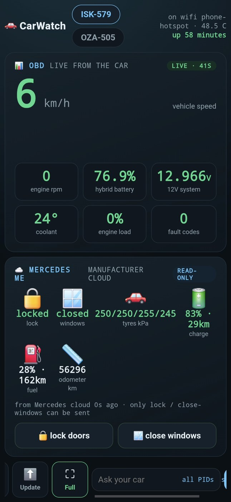

# Release notes

## CarWatch v0.6.0 - a fresh clone runs, and the promises hold while driving

Three merges from one evening's repo review (#23), all about what happens around the car's loop rather than inside it: a fresh clone runs, nothing the car says is lost offline, the self-updater stops interrupting the driver, and the README says what a car agent is for.

**Where this release stands on the honesty scale.** Every earlier release note said "live tested in the car". This one is verified on macOS against the fake ELM327 and 62 unit tests, and unverified on the car: Vadelma was offline when the tag was cut, so it has not yet pulled the code. The first hourly self-update after it comes back online is the live test, and it runs through exactly the update path this release changed. The receipt (the `restart-when-quiet` line in the car's journal) will be posted in the room when it lands.

### A fresh clone runs (#24)

- **One config file.** `carwatch/config.py` resolves it for every module: `$CARWATCH_CONFIG`, then `$CARWATCH_STATE/config.json` (the systemd units point there, `~/.carwatch`), then `~/.carwatch/config.json`, then the legacy `/etc/carwatch/config.json`. Before, the installer wrote one path and the daemons read another, so a cloner's room agent exited on first start. `python3 -m carwatch.config path|get KEY` for shell use.
- **The room poster lives in the repo.** `carwatch.room.post_as_car()` and `python3 -m carwatch.room --file F` replace a script that only existed on the reference Pi; the OBD daemon, the voice listener and the pairing watch use it.
- **Owner from config.** `"owner"` in config.json drives the room gate (the owner and `owner-*` devices; no owner set means any human may address the car) and the presence dashboard target. Car identity defaults are neutral; the reference cars keep theirs through `profiles/<handle>.json`.
- **The installer finishes the job.** Seeds `~/.carwatch/config.json` (migrating an existing `/etc` one), generates the dashboard token, runs `apt-get update`, installs `alsa-utils bluez-alsa-utils ffmpeg network-manager`, and prints the whisper.cpp and piper steps the way it already did for the brain.

### The promises hold while driving (#25)

- **The offline outbox is wired.** Every room post (engine reads, voice transcripts, room answers, voice-note replies) goes through a persistent, locked outbox; whatever cannot be delivered is queued in order and drained within a minute of the signal returning, by the presence heartbeat and the agent's poll, capped at 200 items.
- **The agent retries when the brain fails** instead of marking the question seen and dropping it.
- **Self-update restarts only when something changed and the car is quiet.** `carwatch.guard` reads the files the daemons already write: speed, a ten-minute grace after the last motion, 12 V charging voltage (ignition on), voice state, and the brain lock. `scripts/restart-when-quiet.sh` waits up to an hour for a quiet moment. `update.sh --rollback` returns to the previous commit.

### Use cases (#26)

The README and carwatch.dev gained a **Use cases** section: fourteen cases, each labelled proven, built or enabled, from "ask the car anything, hands free" to "the house warms the car" and "two strangers' agents negotiate a way in". Fixed use cases are what a manufacturer ships; CarWatch ships a grounded car in the same rooms as your other agents.

### Measured, not yet shipped

Manual retrieval was benchmarked on 20 driver questions against the same owner's manual the car indexes: today's lexical search finds the right page in the top five 15 times out of 20, a 300 MB local embedding model 18 of 20 and, counting two gold-set artifacts, 20 of 20; all four lexical misses were vocabulary mismatch ("tyre repair kit" versus TIREFIT). The next manual.py adds embeddings through the llama.cpp server the Pi already runs, fused with the lexical index. No reranker: it bought nothing on a 745-page manual.

### For people running the previous release

Nothing to do. The car pulls this on its next hourly update; the config stays where it is (`~/.carwatch/config.json` already), and the first restart after the pull waits for a quiet moment. Add `"owner": "your-handle"` to config.json if you want the room gate back to owner-only; without it, any human in the room can address the car.

- 62 tests pass (`python3 -m unittest discover -s tests`), 28 new since v0.5.1.
- 27 files changed, about 1,450 lines added, 150 removed.

## CarWatch v0.4.0 - talk to your car, even offline

**You can now talk to your car.** Sit in the seat, say "Hello car" (or tap Speak on the dash) and ask. The car hears you through the cabin, thinks with the model running on the Pi, and answers out of its own speakers with live numbers from its OBD port, its connected-car cloud, and its owner's manual. Filmed proof shipping alongside this release: three questions answered on camera in a parked E-Class, the last one with the internet switched off entirely. The whole loop, speech to answer to speech, runs on the car.

## The voice loop

- Wake phrases or the dash Speak button start a question: "Hello car", "Hey car", "Hei auto" and friends. The question starts at the wake phrase, so rehearsing your pitch next to the car does not send the whole ramble to the brain.
- Follow-up window: for 30 seconds after an answer you can just keep talking, no re-wake needed.
- The car never answers its own voice: the mic stays closed until the answer has actually finished playing in the cabin (player exit is not cabin silence, Bluetooth buffers seconds), and anything that transcribes as a copy of the car's own last answer is dropped as self-echo. This one was found the hard way, live on camera.
- The car never answers ambient chatter either: unaddressed speech stays invisible, and the dash strip shows Listening / Heard / Answering only when you asked.
- Answers play through the car's music channel, the same one the one-tap Brief uses, with headset fallback. The phone-call channel stays closed unless a real call is up, so audio sent there used to vanish silently.
- Speech recognition got a car vocabulary (E10 no longer arrives as "eating"), configurable language, and answers speak in a voice matching their language.
- Playback timeouts scale with the answer length, and other onboard work (model, OBD polling) pauses while the car is speaking so long answers stopped chopping.

## Grounded answers

- The car quotes its own live readings first: OBD values, hybrid charge, fuel range, tyre pressures, then the owner's manual (489 pages, page-cited, fully offline).
- Connected-car readings are treated as current, with no fake "I cannot check that" disclaimers in front of numbers sitting right in the prompt.
- The onboard computer's own vitals identify themselves as such, never mistakable for engine data.
- Brief button: one tap composes and speaks a live status brief from the OBD port.

## Dashboard

- One-screen phone layout with the control dock fixed, a two-column layout on unfolded foldables, and a skin engine (carbon, gamer, hippy, minimal).
- Mercedes me cloud tiles unified onto the OBD tile system, calmer parked view, axle-wise tyre lines.
- A restart can never leave the dash stuck on "answering".

## Under the hood

- ELM327 adapter auto-detection defaults to the first present device (USB, then Bluetooth).
- Raw CAN capture served over the dashboard API for remote byte-hunting, and a steering-angle decode candidate from a parked-sweep session.
- Audio bench tooling: one-command record-and-listen tests that catch playback holes before a human ever sits in the seat.

## Docs

- README talk samples are real dated transcripts a stranger can read.
- License plates blurred in imagery, plate scrubbed from code.

The car in the video is a stock 2021 Mercedes E 300 e. Nothing in the car was modified: a Raspberry Pi 5, an off-the-shelf Bluetooth OBD adapter, and the car's own Bluetooth audio. Everything runs on the Pi; the internet is optional, as the video shows. CarWatch is AGPL and runs on any car with an OBD port; the Mercedes cloud integration is optional.

## CarWatch v0.3.0

The phone dashboard now puts live OBD readings and read-only manufacturer-cloud
data in one glanceable view. This real in-car capture shows speed, engine RPM,
hybrid battery, 12 V system, coolant, fault codes, tyre pressures, charge, fuel
and odometer.

The dashboard labels data by source and freshness, and does not invent values for
signals the car has not actually provided.
